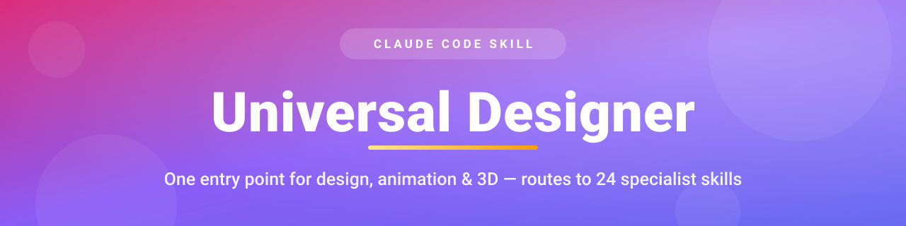

<a name="top"></a>

<div align="center">



<br/><br/>

<!-- Project badges -->
[](https://docs.claude.com/en/docs/claude-code/skills)
[](LICENSE)
[](#-the-24-skills-it-orchestrates)
[](#-contributing)
[](#-metadata)

<!-- GitHub social badges (populate once published) -->
[](https://github.com/satishTheLegend/universal-designer/stargazers)
[](https://github.com/satishTheLegend/universal-designer/network/members)
[](https://github.com/satishTheLegend/universal-designer/issues)
[](https://github.com/satishTheLegend/universal-designer/commits)

<br/>

<!-- Action buttons -->
[](https://github.com/satishTheLegend/universal-designer/stargazers)
[](https://github.com/satishTheLegend/universal-designer/fork)
[](https://github.com/satishTheLegend/universal-designer/issues/new)

<br/>

**📦 [Installation](#-installation) · 💡 [Usage](#-usage-examples) · 🚀 [How it works](#-how-it-works) · 🧭 [Routing](#-fast-routing-cheat-sheet) · 🤝 [Contributing](#-contributing)**

</div>

---

> ❝ One conductor for 24 specialist skills. It picks the right tool, makes the work fit your codebase, and composes the pieces into a coherent, performant, accessible result. ❞

> 💜 **If this skill makes your frontend work easier, please [give it a ⭐](https://github.com/satishTheLegend/universal-designer/stargazers) — it helps others find it!**

## 🎯 Purpose

The frontend skill ecosystem is powerful but **heavily overlapping**, and picking the wrong tool is the single most common failure: GSAP vs AOS, Three.js vs React Three Fiber, Lottie vs Rive, Motion vs React Spring. A beautiful component that fights your stack — or two libraries animating the same property — is a defect, not a feature.

**Universal Designer** does not reimplement any animation/3D/design logic. It guarantees three things no specialist skill can guarantee on its own:

1. 🧱 **The work fits your project's actual architecture** — stack, conventions, dependencies, peer-dep constraints (React 19, SSR/RSC boundaries, "don't break the Flutter app").
2. 🎯 **The right tool is chosen** — overlaps resolved with an explicit decision matrix.
3. 🧩 **The pieces compose** — layer assignment, conflict resolution, performance, accessibility, responsive, and cleanup.

Use it as the **first stop for any visual/frontend task** — on web or Flutter.

## 🚀 How it works

Universal Designer runs a **mandatory 5-phase workflow**, invoking specialist skills via the Skill tool rather than reinventing them:

| Phase | What happens |
|---|---|
| **0 — Understand the architecture** *(never skip)* | Runs the bundled `scripts/detect_stack.sh` to detect framework, package manager, already-installed libraries, and monorepo layout, then verifies by reading the project. Loads `references/architecture-playbook.md`. |
| **1 — Establish design direction** | The taste layer, in order: `modern-web-design` (strategy & budgets) → `ui-ux-pro-max` (system, palettes, font pairings, UX rules) → `frontend-design` (commit to one bold, non-generic aesthetic). |
| **2 — Route execution** | Translates direction into concrete specialist skills via `references/decision-matrix.md` (intent → skill, with overlap tie-breakers), preferring the skill aligned with the detected stack. |
| **3 — Compose & integrate** | When multiple skills are used, applies layering rules from `web3d-integration-patterns` (one render loop, no two libraries on the same property, correct state/refs). Loads `references/integration-and-quality.md`. |
| **4 — Quality gates** *(always)* | Performance (animate transform/opacity, lazy-load 3D, dispose GPU resources), accessibility (`prefers-reduced-motion`, contrast, keyboard, escape hatch for scroll-hijacking), responsive, cleanup on unmount, and mobile-app safety. |

Claude Code reads the `description` in `SKILL.md` and **auto-activates** Universal Designer whenever a task involves building, designing, redesigning, reviewing, fixing, or animating any UI/UX, web page, landing page, dashboard, component, hero, scroll experience, page transition, 3D scene, product viewer, data-viz, micro-interaction, or visual effect.

## 🧰 The 24 skills it orchestrates

| Layer | Skills (invoked by name) |
|---|---|
| 🎨 **Design system / taste** | `modern-web-design`, `ui-ux-pro-max`, `frontend-design` |
| ⚛️ **UI motion (React)** | `motion-framer`, `react-spring-physics`, `animated-component-libraries` |
| 🌀 **UI motion (agnostic)** | `animejs` |
| 📜 **Scroll & transitions** | `gsap-scrolltrigger`, `locomotive-scroll`, `scroll-reveal-libraries` (AOS), `barba-js` |
| 🧊 **3D engines** | `threejs-webgl`, `react-three-fiber`, `babylonjs-engine`, `playcanvas-engine`, `aframe-webxr` |
| ✨ **2D / effects / assets** | `pixijs-2d`, `lightweight-3d-effects` (Zdog/Vanta/Tilt), `lottie-animations`, `rive-interactive` |
| 🛠️ **3D authoring pipeline** | `blender-web-pipeline`, `spline-interactive`, `substance-3d-texturing` |
| 🔗 **Integration meta** | `web3d-integration-patterns` |

> 💡 Universal Designer is the conductor — it works best when the specialist skills above are also installed. It will still set direction and route correctly without them, but execution detail lives in the specialists.

## 🧭 Fast routing cheat-sheet

- **Simple fade/slide on scroll** → `scroll-reveal-libraries` (AOS). Don't reach for GSAP.
- **Complex scroll timeline / pin / scrub / parallax** → `gsap-scrolltrigger` (+ `locomotive-scroll` if a smooth-scroll container is required).
- **React UI animation / gestures / layout / exit** → `motion-framer`.
- **Physics-real, interruptible, momentum motion** → `react-spring-physics`.
- **Vanilla/SVG timeline, no React** → `animejs`.
- **Pre-built animated React components, fast** → `animated-component-libraries`.
- **Multi-page site, SPA-feel transitions** → `barba-js`.
- **3D in React** → `react-three-fiber`; **vanilla/max control** → `threejs-webgl`; **physics/game/WebXR** → `babylonjs-engine`; **ECS/editor game** → `playcanvas-engine`; **VR/AR/360** → `aframe-webxr`.
- **Designer-made AE animation** → `lottie-animations`; **stateful interactive vector** → `rive-interactive`; **decorative bg/tilt** → `lightweight-3d-effects`; **thousands of 2D sprites** → `pixijs-2d`.
- **Need 3D assets** → author with `blender-web-pipeline` / `spline-interactive`, texture with `substance-3d-texturing`.
- **Combining 3+ libraries** → `web3d-integration-patterns`.

## 📋 Metadata

| Field | Value |
|---|---|
| **Skill name** | `universal-designer` |
| **Suggested command** | `/universal-designer` |
| **Type** | Meta-orchestrator for frontend design / animation / 3D |
| **Orchestrates** | 24 specialist skills across 8 layers |
| **Targets** | Web (React/Next/Vue/Svelte/vanilla) and Flutter |
| **Format** | `SKILL.md` + 4 reference files + stack-detection script |
| **License** | MIT |

## 📦 Installation

Claude Code loads skills from `~/.claude/skills/` (personal) or `<project>/.claude/skills/` (project-scoped). Clone the whole folder so `references/` and `scripts/` travel with `SKILL.md`.

### Option A — Personal skill (recommended)

```bash
git clone https://github.com/satishTheLegend/universal-designer.git \
  ~/.claude/skills/universal-designer
```

### Option B — Project skill

```bash
# from your project root
git clone https://github.com/satishTheLegend/universal-designer.git \
  .claude/skills/universal-designer
```

### Option C — Git submodule

```bash
git submodule add https://github.com/satishTheLegend/universal-designer.git \
  .claude/skills/universal-designer
```

Restart Claude Code (or start a new session) to discover the skill. ✅ The bundled detector is plain bash (coreutils + grep, no extra deps):

```bash
bash ~/.claude/skills/universal-designer/scripts/detect_stack.sh [project-root]   # defaults to CWD
```

## 💡 Usage examples

### A scroll-driven landing page

> "Build a landing page with a pinned hero, a scroll-scrubbed product reveal, and a 3D model the user can orbit."

→ Phase 0 detects your stack; Phase 1 sets direction; Phase 2 routes to `gsap-scrolltrigger` for the pin/scrub and `react-three-fiber` (React) or `threejs-webgl` (vanilla) for the model; Phase 3 assigns layers so GSAP and the render loop don't fight; Phase 4 enforces reduced-motion, lazy-loading, and GPU disposal.

### Pick the right tool, once

> "Should I use AOS or GSAP for these section reveals?"

→ Routes to `scroll-reveal-libraries` (AOS) for simple reveals and reserves `gsap-scrolltrigger` for genuine timelines/pinning — and won't stack both on the same reveal.

### Redesign within an existing codebase

> "Make our dashboard feel modern without breaking the shared components or the Flutter app."

→ Reuses existing design infra instead of rebuilding, honors peer-dep constraints, and runs the mobile-app safety gate before declaring done.

## 🗂️ Skill structure

```text
universal-designer/
├── SKILL.md                          # the orchestration workflow + golden rules
├── references/
│   ├── architecture-playbook.md      # stack detection + per-architecture adaptation (Phase 0)
│   ├── decision-matrix.md            # intent → skill routing + overlap tie-breakers (Phase 2)
│   ├── integration-and-quality.md    # composition, layering, perf & a11y gates (Phases 3–4)
│   └── skill-catalog.md              # deep dossier on every skill (what/when/gotchas/pairings)
├── scripts/
│   └── detect_stack.sh               # Phase 0 stack detector (bash, no deps)
├── README.md                         # this file
├── LICENSE                           # MIT
└── .gitignore
```

## 🛡️ Golden rules (the guardrails)

1. **Architecture before aesthetics.** Phase 0 is non-negotiable.
2. **Reuse before rebuild.** Extend existing infra; don't duplicate it.
3. **One tool per job.** Resolve overlaps with the decision matrix.
4. **Verify deps before suggesting installs.** Honor React 19 / SSR-RSC / Flutter constraints.
5. **Always ship the quality gates** — reduced-motion, responsive, and cleanup are not optional.
6. **Invoke, don't reinvent.** Delegate execution to the specialist; orchestrate and integrate.

## 🤝 Contributing

Contributions are welcome! 🎉

1. 🍴 Fork the repository.
2. ✏️ Edit `SKILL.md` (workflow/rules) or the relevant `references/*.md` file. Keep the frontmatter `name`/`description` accurate — `description` drives auto-activation.
3. 🧭 If you add or change a routing decision, update `references/decision-matrix.md` and `references/skill-catalog.md` so they stay consistent.
4. 🛡️ Keep recommendations stack-aware and quality-gated (performance, accessibility, responsive, cleanup).
5. 🚀 Open a pull request describing the change and its rationale.

## ⭐ Show your support

If **Universal Designer** helped you ship something beautiful, please give it a star — it genuinely helps others discover the project and motivates continued work. 🙏

[](https://github.com/satishTheLegend/universal-designer/stargazers)

> 💬 Have an idea or found a bug? [Open an issue](https://github.com/satishTheLegend/universal-designer/issues/new) or [submit a PR](#-contributing).

## 📄 License

Released under the [MIT License](LICENSE) — free to use, modify, and distribute.

---

<div align="center">

**Made with 💜 for the Claude Code community**

⭐ [Star](https://github.com/satishTheLegend/universal-designer/stargazers) · 🍴 [Fork](https://github.com/satishTheLegend/universal-designer/fork) · 🐛 [Issues](https://github.com/satishTheLegend/universal-designer/issues)

[⬆ Back to top](#top)

</div>
